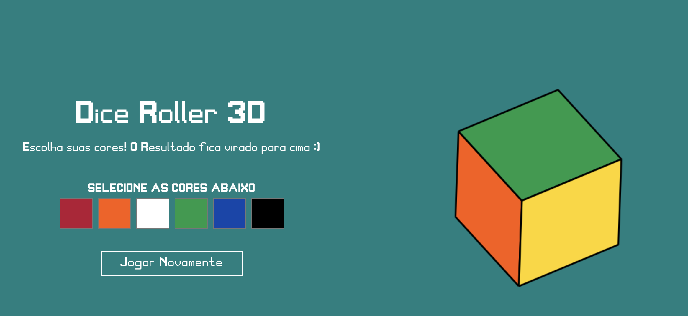
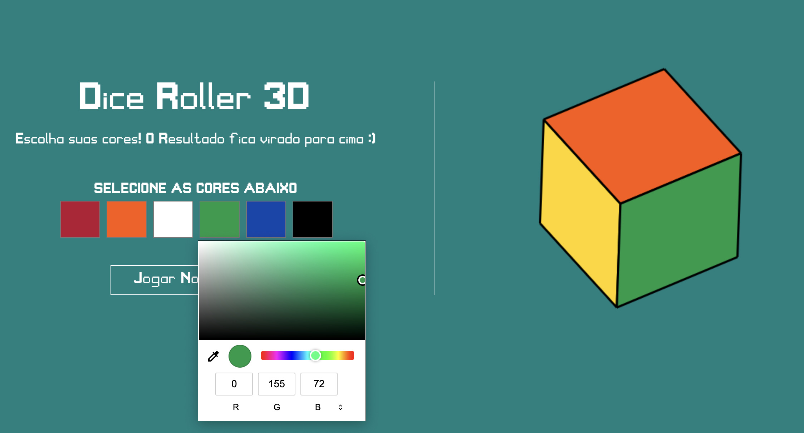
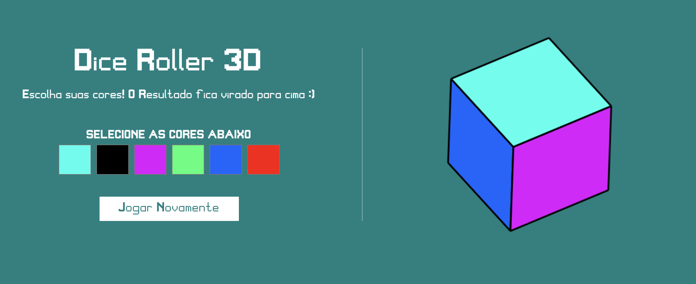

# 3D Color Dice Roller

**Número da Lista**: 36 
**Conteúdo da Disciplina**: D&C 

## Alunos

| Matrícula | Aluno                                                |
| --------- | ---------------------------------------------------- |
| 170144488 | [Henrique Melo](https://github.com/HenriqueAmorim20) |
| 180122258 | [Igor Queiroz Lima](https://github.com/igorq937)     |

## Sobre 
Se trata de um dado de cores em 3D, você pode selecionar as cores do dado e jogar várias vezes. O resultado é a face do dado virada para cima.

## Screenshots
 
 
 

## Instalação 
**Linguagem**: JavaScript 

Pode ser executado utilizando a extensão [Live Server](https://marketplace.visualstudio.com/items?itemName=ritwickdey.LiveServer) do VSCode ou utilizando [http-server](https://github.com/http-party/http-server) que pode ser instalado com o comando ``npm install --global http-server``.

## Uso

Para utilizar sem nenhuma instalação acesse https://projeto-de-algoritmos.github.io/DC_3D-Color-Dice-Roller;

Caso deseje usar a exetensão Live Server do VSCode, abra o arquivo ``index.html`` com a extensão;

Caso deseje usar http-server, basta utilizar o comando no diretório root do projeto ``http-server``.

***OBS:*** Utilizar apenas o navegador e executar o index.html não funcionará!

